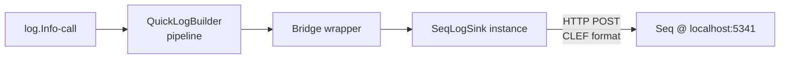
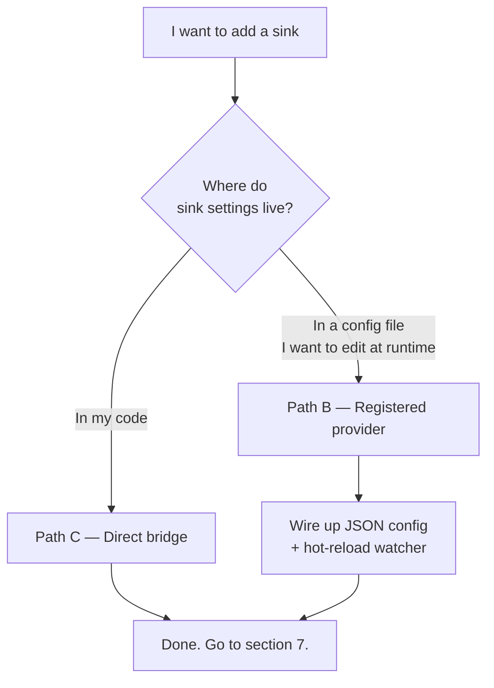
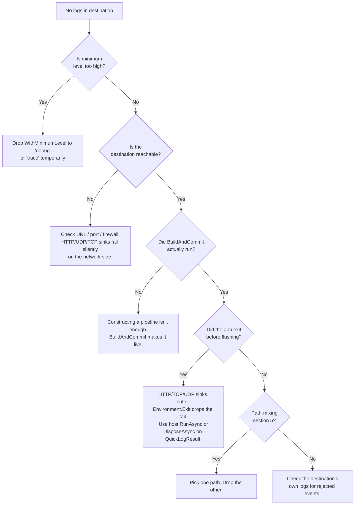
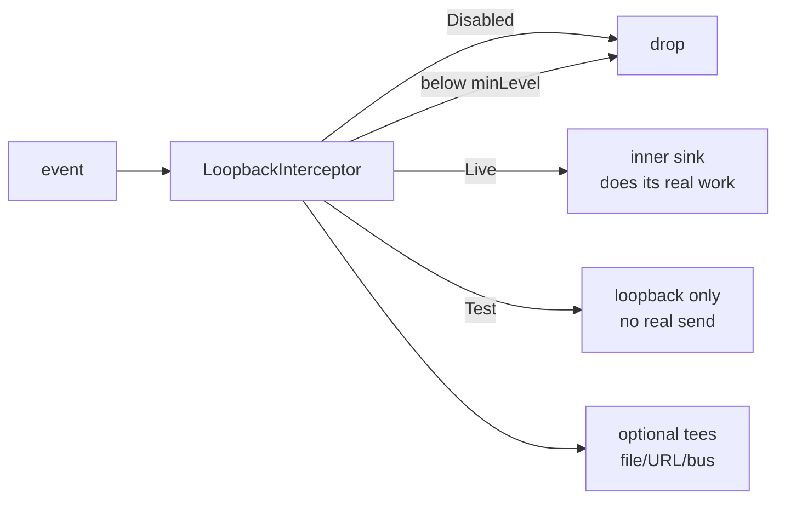

# Adding a sink to your app

Send your structured logs somewhere useful — Seq, Datadog, Splunk, Loki, your file system, your console. Each destination ships as its own NuGet package. Wiring one up is a one-liner once you know the pattern.

> **Reading this top-to-bottom?** Sections 1 and 2 get you a log line landing in Seq within five minutes. The rest is the longer story for when you want the production wiring or you're chasing a "where did my logs go" mystery.

## 1. The five-minute demo

You need three things:

1. A .NET 8 (or newer) project.
2. The Herald.OSS NuGet package and one sink package.
3. Somewhere for the logs to land.

We'll use **Seq** because you can run it locally in Docker and watch logs land in your browser — no signup, no API key wrangling.

### Spin up Seq locally

```bash
docker run --name seq -d --restart=unless-stopped \
  -e ACCEPT_EULA=Y \
  -p 5341:80 \
  datalust/seq
```

Port 5341 is both the ingestion endpoint and the UI. Open `http://localhost:5341` in a browser. That's where your logs will appear.

### Install the packages

```bash
dotnet add package Herald.OSS
dotnet add package Herald.Sinks.Seq
```

### Wire it up

```csharp
using MMP.Herald.Quick;
using MMP.Herald.Events;
using Herald.Sinks.Seq;

// Build the sink yourself — apiKey is optional on a local Seq.
var seq = new SeqLogSink("http://localhost:5341");

// One pipeline, one sink, one logger.
var log = QuickLogBuilder.Create("my-app")
    .WithMinimumLevel("info")
    .WithBridge(seq)
    .BuildAndCommit()
    .Logger;

log.Info(new LogCategory("App"), "hello, Seq");
```

Run it. Refresh `http://localhost:5341`. Your log line is there.

That's the whole demo. If you stop reading now, you've got a working sink. The rest of this doc is the production story.

## 2. What just happened

Here's the picture:



Three pieces:

- **The sink** — `SeqLogSink` is a class that implements Herald's `ILogger` interface. Give it a constructor's worth of config and it knows how to talk to its destination.
- **The bridge** — `WithBridge(sink)` plugs any `ILogger` into the pipeline. It's the universal escape hatch: if you can construct a sink, you can bridge it.
- **The pipeline** — `QuickLogBuilder` wires it all up. The `BuildAndCommit()` call locks in the configuration and hands you a `StructuredLogger` you can call `.Info(...)` on.

Sinks are just `ILogger` implementations. Bridges are how you attach them. That's the whole mental model.

## 3. Pick a path

Section 1 showed you Path C (direct bridge). It's the simplest. There's a second path that scales better when you're shipping production code that needs to read its config from a file. You probably want Path C; jump straight to section 7 (verify it's working) if you're done — or section 6 if you need more than one sink.

| Path | What you write | Best when |
|---|---|---|
| **C — Direct bridge** | `new SeqLogSink(...)` + `.WithBridge(sink)` | You know the config at compile time. You want the fewest moving parts. |
| **B — Registered provider** | `SeqSinkRegistration.RegisterAll(LogSinkProviderRegistry.Default)` + JSON config | You want sink settings in a config file. You want hot-reload to change them without a redeploy. |



## 4. Path B — Registered provider

If you want your sink config in `herald.json` (or similar) and you want the operator to be able to edit that file at runtime, you go through the provider registry instead.

```csharp
using MMP.Herald.Quick;
using MMP.Herald.Routing;
using Herald.Sinks.Seq;

// Once at startup — before you build the pipeline.
SeqSinkRegistration.RegisterAll(LogSinkProviderRegistry.Default);

// Pipeline build reads the registry and resolves "kind: seq" against it.
var log = QuickLogBuilder.Create("my-app")
    .WithMinimumLevel("info")
    .WithJsonConfig("herald.json")    // your config file specifies sinks by kind
    .BuildAndCommit()
    .Logger;
```

Then your `herald.json` carries the actual settings:

```json
{
  "sinks": [
    {
      "kind": "seq",
      "uri": "http://localhost:5341",
      "alias": "your-api-key-or-empty"
    }
  ]
}
```

Now `herald.json` is the source of truth. Operators change the URL or API key, hot-reload picks it up, the pipeline rebuilds. The sink's *behaviour* is in your code; its *configuration* is in the file.

`RegisterAll(...)` is idempotent — calling it twice doesn't double-register. Every sink package ships its own `<Name>SinkRegistration` helper with the same shape.

## 5. The trap — don't mix paths

This is the one mistake worth calling out explicitly:

```csharp
// 🚨 Don't do this — you get TWO sinks both posting to Seq.

var seq = new SeqLogSink("http://localhost:5341");
SeqSinkRegistration.RegisterAll(LogSinkProviderRegistry.Default);

QuickLogBuilder.Create("my-app")
    .WithBridge(seq)                   // adds one sink via the bridge
    .WithJsonConfig("herald.json")     // adds another via the registry
    .BuildAndCommit();
```

Bridges and the registry are different paths into the pipeline. They don't dedupe against each other. Every event gets posted to Seq twice. Your Seq instance sees double the events. Your bill (or your disk) doubles.

The fix: pick one. Path C uses the bridge; Path B uses the registry. Don't combine them for the same destination.

## 6. Multiple sinks, named — discovery and CRUD

One sink, one configuration is the easy case. The real world has three: an alerts channel that only cares about warnings, a main log file that takes everything, and a debug-trace endpoint that catches the noise. Same pipeline, three sinks, three different minimum levels.

```csharp
var result = QuickLogBuilder.Create("my-app")
    .WithMinimumLevel("trace")                                            // accept everything; per-sink filters do the real work
    .WithJsonConfig("herald.json")                                        // where persist:true will write
    .WithHotReload()                                                      // enables runtime Remove
    .WithHttpJsonSink("https://alerts.example.com", minLevel: "warn",
                      name: "alerts")
    .WithFileSink("logs/main.ndjson", minLevel: "info", name: "main")
    .WithHttpJsonSink("https://diag.example.com", minLevel: "trace",
                      name: "diag")
    .BuildAndCommit();
```

The `name:` parameter is the handle. It works on every sink-adding method (`WithFileSink`, `WithConsoleSink`, `WithHttpJsonSink`, `WithUdpJsonLineSink`, …). If you don't pass one, Herald auto-names — `http_json`, `http_json_2`, `http_json_3` for siblings — and explicit names skip the auto path so you can't collide by accident.

### "I forgot the names"

`result.Sinks` is a name-keyed dictionary. Enumerate it, look one up, read what it's doing:

```csharp
foreach (var sink in result.Sinks.Values)
    Console.WriteLine($"{sink.Name,-10}  {sink.Kind,-12}  {sink.MinLevel}  {sink.RunState}");

// alerts      http_json     warn   Live
// main        json_file     info   Live
// diag        http_json     trace  Live
```

`SinkInfo` carries the operator-visible state: `Name`, `Kind`, `MinLevel`, `RunState`, `TeeLiveToFile`, `TeeLiveToUrl`. Read-only — to change anything, use the mutators.

### CRUD on a chosen sink

```csharp
// READ — already covered. Indexer or .Values enumeration.
var info = result.Sinks["alerts"];

// UPDATE — every mutator takes persist:false (default) or persist:true.
//   persist:false  — change is in-memory only. Survives until process restart.
//   persist:true   — also writes herald.json. Survives across restarts.
result.Sinks.SetMinLevel("alerts", "error", persist: true);
result.Sinks.SetRunState("alerts", SinkRunState.Test);        // triage in test mode
result.Sinks.SetTeeLiveToFile("alerts", on: true);
result.Sinks.Patch("alerts", new SinkRuntimeOverride(         // multi-field in one call
    RunState: "live", MinLevel: "warn", TeeLiveToFile: false));

// Three-button shortcuts (mirror what the dashboard shows):
result.Sinks.SetLive("alerts");
result.Sinks.SetTest("alerts");
result.Sinks.SetDisabled("alerts");                            // see "triage flow" below

// DELETE — hard remove. Different from SetDisabled.
result.Sinks.Remove("alerts", persist: true);
```

### The triage flow — `SetDisabled` is a panic button, not a config state

The three states a sink can be in:

| State | What happens to events | When to use |
|---|---|---|
| **Live** | Sink receives every event that passes its minimum-level filter. | Normal operation. |
| **Test** | Real send is suppressed. Events flow only to loopback channels (file dir or URL) if configured. | "I want to see what this sink would send without it actually sending." Investigation, dry-runs. |
| **Disabled** | Drop. The sink never sees the event. | **Triage only.** A sink is misbehaving (spewing errors, blocking, costing money). Flip it to Disabled, fix the underlying issue, then either `SetLive` to restore or `Remove` to delete entirely. |

`Disabled` is not "a fourth steady state" — it's the brake handle. The complete flow:

```
1. SetDisabled("alerts")        ← immediate stop, other sinks unaffected
2. (operator investigates, fixes the root cause)
3a. SetLive("alerts")           ← restore service
3b. Remove("alerts", persist:true)  ← if the sink shouldn't come back
```

`SetDisabled` keeps the config — connection string, URL, API key — so flipping back to Live is one call. `Remove` strips the entry entirely; persisting it means a process restart won't bring the sink back.

### Quick reference

| Goal | Call |
|---|---|
| Make a sink stop receiving events right now | `result.Sinks.SetDisabled(name)` |
| Test what a sink would send without it actually sending | `result.Sinks.SetTest(name)` |
| Resume normal operation | `result.Sinks.SetLive(name)` |
| Change minimum level temporarily | `result.Sinks.SetMinLevel(name, "warn")` |
| Change minimum level for keeps | `result.Sinks.SetMinLevel(name, "warn", persist: true)` |
| Remove the sink from the running pipeline | `result.Sinks.Remove(name)` |
| Remove the sink everywhere — running pipeline AND the JSON | `result.Sinks.Remove(name, persist: true)` |

Hard remove needs hot-reload enabled (`.WithHotReload()` on the builder). Without it, `Remove` throws a clear error pointing you at `SetDisabled` as the in-place alternative.

## 7. Verify it's actually working

A log went somewhere. How do you know it landed?

- **Seq:** open `http://localhost:5341`, look for the most recent event. Your `hello, Seq` is there.
- **Console sink:** look at your terminal.
- **File sink:** `tail logs/my-app.ndjson` (or wherever you pointed it).
- **HTTP sink (generic):** Herald posts to the URL. The destination's own UI shows whether it arrived.

If you don't see anything, head to section 8.

## 8. When things go quiet — troubleshooting

The top five reasons logs don't appear, in order of how often they happen:



Quick checklist version, if mermaid isn't your style:

1. **Minimum level too high.** Default is often `info`. If you're emitting `Debug` events, they're filtered before they reach the sink.
2. **Destination unreachable.** Network sinks (HTTP, TCP, UDP) won't shout at you when they can't connect. Check the destination's own UI for "no incoming events."
3. **Forgot `BuildAndCommit()`.** Constructing a `QuickLogBuilder` doesn't activate anything. Only `BuildAndCommit()` makes the pipeline live and returns a usable logger.
4. **App exited before flush.** Network sinks buffer events. A short-lived program that calls `Environment.Exit` or returns immediately may lose the last few events. Run inside `host.RunAsync()` (ASP.NET Core, Worker Service) or dispose the `QuickLogResult` explicitly.
5. **Mixed Path B + Path C** for the same destination — re-read section 5.

## 9. Going further

This doc stops at one log line landing somewhere. The longer story:

- **Multiple sinks (fanout) and the operator surface.** Section 6 walks the three-sink case and the CRUD model. The `Modules/Herald.SampleApps/src/Herald.SampleApps.LogRouter/Program.cs` sample is the canonical larger example — six sinks in 80 lines.
- **DI + ASP.NET Core integration.** Where to register the logger in `Program.cs`, how to make it injectable, how it interacts with the host's lifetime. See the LogRouter sample's `AddSingleton(_ => QuickLogBuilder…)` shape.
- **Microsoft.Extensions.Logging interop.** Herald carries richer event shapes than `ILogger<T>`. The two systems can coexist via an adapter, but it's not free. Out of scope here.
- **Hot-reload.** Edit `herald.json`, the pipeline rebuilds without a restart. Enabled by `.WithHotReload()` on the builder.
- **Writing your own sink.** Implement `ILogger` and `ILogSinkProvider`, ship a `CAPABILITY.yaml`, run `dotnet pack`. See `CONTRIBUTING.md` at the repo root.

## 10. Peek under the hood

You don't need this to use Herald. Read it if you want to know why the pieces fit together the way they do — debugging gets easier when the model in your head matches the model in the code.

### Two registries, two purposes

Herald keeps two name spaces that look similar but solve different problems:

- **`LogSinkProviderRegistry`** is keyed by **sink kind** (`"http_json"`, `"text_file"`, `"seq"`, …). The job: given a kind, construct a sink. This is where `<Name>SinkRegistration.RegisterAll(...)` deposits its factories. One entry per kind.
- **`SinkRunStateRegistry` + `SinkOverridesRegistry`** are keyed by **(pipelineName, sinkName)**. The job: given a running sink, hold its runtime state (Live / Test / Disabled + minimum level + tee flags). One entry per sink instance.

Names matter at the second registry. Two HTTP sinks of the same kind have one factory between them but two state holders. That's how `result.Sinks.SetMinLevel("alerts", ...)` mutates the alerts sink without touching the diag sink.

### Every sink is wrapped — and the sink author never sees it

A sink author writes a class that implements `ILogger`. One method, `Log(LogEvent)`. That's the whole contract.

At pipeline construction time, Herald wraps every sink with a `LoopbackInterceptor`. The wrapper is the layer that:

- Reads the run-state holder. If Disabled, the event short-circuits and the inner sink never sees it.
- Reads the per-sink minimum-level gate. If the event is below, it drops.
- Routes Live → forward to the inner sink, Test → suppress the real send, route to loopbacks.
- Fires the tee legs (file / URL / bus) per the flag holders.



The wrapping is automatic and unconditional in Herald.OSS. Sink authors don't opt in; they can't opt out. They write the sink that does the one thing it does, and the gate, the test-mode plumbing, and the runtime mutation surface come for free.

This is deliberate — sinks stay isolated. A sink can't reach back into the pipeline, can't see its peers, can't disable a competitor. The mutator surface lives on `result.Sinks` (held by the application), not on a sink-accessible channel. If a sink wanted to be self-aware ("disable me when I'm overloaded"), the right pattern is an event the application subscribes to and a call to `result.Sinks.SetDisabled(name)` from the application — not a back-reference.

### What `Remove` actually does

Hard remove is the one operation that needs more than a holder flip. Here's the sequence:

1. Pull the sink from the builder's source state — clear the singleton field for file/console/null, or remove from the network-sink list (matched by resolved name).
2. Drop the runtime-override snapshot for that name so a future sink with the same name doesn't inherit stale state.
3. Re-run `builder.Build()` to produce a new JSON config and a new pipeline graph.
4. Call `hotReload.Reload(newJson)` — the running pipeline is swapped atomically. Events in flight finish on the old pipeline; new events route through the new one.
5. Drop the entry from `result.Sinks` so the dictionary view matches the live pipeline.
6. If `persist:true`, also write the new JSON to disk.

That's why Remove needs `.WithHotReload()` enabled — step 4 requires it. Without hot reload, the dictionary view would drift from the actual kernel fan-out, and Herald refuses to let that happen.

### JSON is the source of truth

The on-disk config and the running pipeline stay aligned through one rule: every persist-to-disk path goes through the builder's own serializer. `result.Sinks.SetMinLevel(name, "warn", persist:true)` mirrors the change into the builder's runtime overrides, then calls `builder.ExportConfigJsonToFile`. A fresh process loading from the same file reconstructs the same pipeline — same sinks, same names, same minimum levels, same run states.

That's the whole loop: the API mutates the runtime, the builder remembers it, the file holds it, and the next load round-trips. No second sync path. No "JSON says X but the running pipeline says Y" drift.

## 11. Cheat sheet

Stick this at the bottom of your screen while you work:

```csharp
// Direct bridge (Path C):
var sink = new <Name>LogSink(/* config */);
QuickLogBuilder.Create("my-app")
    .WithMinimumLevel("info")
    .WithBridge(sink)
    .BuildAndCommit()
    .Logger;

// Registered provider (Path B):
<Name>SinkRegistration.RegisterAll(LogSinkProviderRegistry.Default);
QuickLogBuilder.Create("my-app")
    .WithJsonConfig("herald.json")
    .BuildAndCommit()
    .Logger;

// Log:
log.Info(new LogCategory("App"), "your message {Property}", new LogProperty("Property", value));
```

That's all of it. Pick a path, send a log, refresh the destination. If something's quiet, section 8 has you covered.
