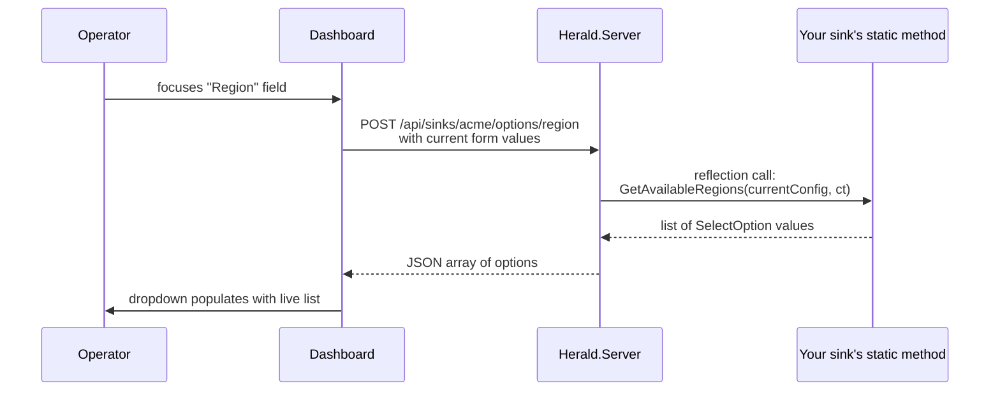
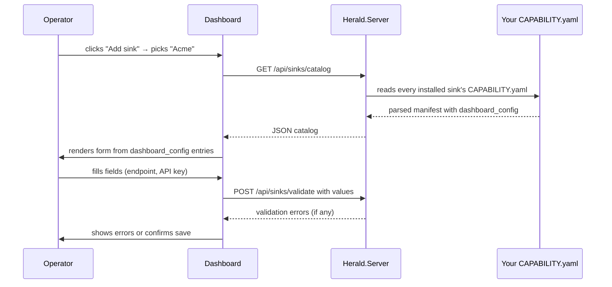

# Writing a Sink for Herald — Programming Guide

A step-by-step guide to building a new log-sink for Herald. Aimed at a programmer who knows basic C# but has never worked on Herald before. Every concept is explained before it's used; every code sample is complete enough to paste and adapt.

By the end you'll have a working sink that ships events to a destination of your choice, with a configuration form that appears automatically in the Herald Dashboard.

## Part 1 — What you're building

A **sink** is the thing that takes a log event and sends it somewhere — a file, a web service, a database, a Kafka topic, whatever. Your job is to write that "whatever."

Herald does all the hard work leading up to the sink. By the time an event reaches you, it's been filtered for level, enriched with metadata, queued for async delivery, maybe batched with other events. Your sink just has to answer one question:

> "I've been handed a `LogEvent`. What should I do with it?"

For most sinks, the answer is "serialize it and send it somewhere."

### Where your sink fits

```mermaid
graph TD
    App[Application code<br/>logger.Info&#40;...&#41;]
    Pipeline[Herald pipeline<br/>filters, enrichers, async queue,<br/>batching, rendering, routing]
    Fanout[Fan-out<br/>deliver to each sink]
    Sink1[Your new sink]
    Sink2[Console sink]
    Sink3[File sink]

    App --> Pipeline
    Pipeline --> Fanout
    Fanout --> Sink1
    Fanout --> Sink2
    Fanout --> Sink3
```



Your sink is at the end of the pipeline. It sees the event last. Other decorators have already done the filtering, enrichment, batching, and rendering. The event you receive is final — you just need to deliver it.

### Analogy: the mailbox

Think of Herald as a post office:

- The **application** writes a letter (a log event)
- The **pipeline** sorts, stamps, and bundles the letter (filters, enrichers, batching)
- The **sink** is the mailbox where the letter actually goes out — one mailbox might be a file on disk, another might be an HTTP endpoint, another might be Slack

Your job is to build one mailbox. You don't care about sorting or stamping. You just take what's handed to you and make sure it leaves the building.

## Part 2 — The two pieces every sink ships

Every sink is exactly two classes working together:

```mermaid
graph LR
    Config[JSON config or fluent builder:<br/>&quot;kind&quot;: &quot;acme&quot;,<br/>&quot;endpoint&quot;: &quot;...&quot;]
    Provider[AcmeLogSinkProvider<br/>the factory]
    Sink[AcmeLogSink<br/>the worker]
    Event[LogEvent]

    Config -->|bootstrap reads config| Provider
    Provider -->|creates| Sink
    Event -->|logger.Info&#40;...&#41; eventually reaches| Sink
```



**The provider (`AcmeLogSinkProvider`)** is a factory. Herald's bootstrap code sees `"kind": "acme"` in your config, asks the provider to build a sink, and the provider returns one.

**The sink (`AcmeLogSink`)** is the worker. It receives events one by one and ships them to the destination.

That's it. Nothing else. You don't need to know about async queues, filters, decorators, or any other Herald machinery. The provider creates the worker, the worker ships events.

### The sink contract

Every sink implements one interface:

```csharp
// This is already defined in Herald.Core — you just implement it.
public interface ILogger
{
    // Called once per event (or once per batch if you implement IBatchedLogSink).
    void Log(LogEvent logEvent);

    // Optional — only override if your destination supports real async I/O.
    // Default forwards to Log() which is fine for most HTTP sinks.
    ValueTask LogAsync(LogEvent logEvent, CancellationToken cancellationToken = default);
}
```

That's the whole contract. Everything your sink does happens inside `Log` or `LogAsync`.

### The provider contract

```csharp
public interface ILogSinkProvider
{
    string SinkKind { get; }                          // "acme" — matches the JSON config
    HeraldEdition MinimumEdition { get; }             // Community | Pro | Enterprise
    ILogger CreateSink(
        LoggingRuntimeSinkDefinition definition,
        ILogLevelRegistry levelRegistry,
        ILogOutputTransformerRegistry transformerRegistry);
}
```

The provider's only job is to read `definition` (which carries the config values the user set) and return a new sink instance.

## Part 3 — The files you'll write

A sink ships as five files in a specific layout:

```
src/Herald.Sinks.Acme/
├── Herald.Sinks.Acme.csproj        # the .NET project file
├── CAPABILITY.yaml                  # the manifest (form fields, capabilities, etc.)
├── AcmeLogSink.cs                   # the worker
├── Providers/
│   └── AcmeLogSinkProvider.cs       # the factory
└── README.md                        # optional — only if there's operator nuance
                                     # CAPABILITY.yaml doesn't cover

tests/Herald.Sinks.Acme.Tests/
├── Herald.Sinks.Acme.Tests.csproj   # the test project
└── AcmeLogSinkTests.cs              # your tests
```

Five files. Three of them (`csproj`, the provider, the test project) are boilerplate you copy from another sink. The two that carry your logic are the sink class and the `CAPABILITY.yaml`.

## Part 4 — The CAPABILITY.yaml, property by property

The manifest is the contract between your sink and everything that consumes it — the Dashboard, the product-sheet generator, the NuGet package, the release pipeline. Every field has a purpose; none of them are optional without a stated default.

Here's every property, grouped by section.

### Identity (who this sink is)

| Property | Example | Purpose |
| --- | --- | --- |
| `name` | `Herald.Sinks.Acme` | Must match the csproj filename exactly. The build validates this. |
| `package_id` | `MMP.Herald.Sinks.Acme` | The NuGet package id published to nuget.org. Must start with `MMP.Herald.Sinks.`. |
| `version` | `1.0.0` | Must match `<Version>` in the csproj. Release scripts use this to decide whether to publish. |
| `kind` | `sink` | Always `sink` in this repo. Reserved for future categories. |
| `category` | `observability` | One of: `observability`, `cloud-archive`, `alerting`, `analytics`, `community`. Drives the product-sheet grouping. |

### Human-readable (what people see)

| Property | Example | Purpose |
| --- | --- | --- |
| `purpose` | "Posts log events to Acme's intake." | One to three sentences. Flows into the NuGet package description. Keep under 300 characters. |
| `vendor.name` | `Acme Observability` | The company or product behind the destination. |
| `vendor.url` | `https://acme.example.com` | Link to the vendor's docs. |

### What ships (the API surface)

| Property | Example | Purpose |
| --- | --- | --- |
| `ships` | `[AcmeLogSink, AcmeLogSinkProvider]` | Every public type the package exports. Readers use this to know what they can `using` without opening the repo. |

### Dependencies (what the sink needs)

| Property | Example | Purpose |
| --- | --- | --- |
| `requires.core_version` | `">=1.0.0"` | Minimum Herald.Core version your sink was tested against. Bump when you start using a new Core contract. |
| `requires.nuget` | see example | External NuGet packages beyond Core. Omit for BCL-only sinks. |
| `requires.external` | `["Acme API key"]` | Things the operator must have outside code — accounts, credentials, reachable endpoints. |

### `config` (the raw JSON-config shape)

This block describes how a handwritten JSON config file maps to your sink. Operators who edit config files by hand read this; the Dashboard uses `dashboard_config` (below) instead.

| Property | Example | Purpose |
| --- | --- | --- |
| `config.kind` | `acme` | The string operators put in `"kind": "..."` to pick your sink. |
| `config.uri` | `"https://ingest.acme.com"` | What the `uri` JSON field means. `null` if the sink doesn't read it. |
| `config.host` | `"service name"` | What the `host` JSON field means. `null` if unused. |
| `config.alias` | `"API key"` | What the `alias` JSON field means. `null` if unused. |
| `config.notes` | multi-line text | Anything operators need to know — defaults, override patterns, auth shape. |

### `dashboard_config` — the form the Dashboard renders

This is where your sink says "here are the fields I want a user to set." One entry per form field.

Five fields are required per entry:

| Property | Example | Purpose |
| --- | --- | --- |
| `property` | `api_key` | The key name your provider reads from the config at bootstrap. |
| `name` | `API key` | The human label shown above the field. |
| `help` | multi-line text | Longer guidance shown below the field. |
| `tooltip` | `"Datadog DD-API-KEY — masked after save."` | Short hover hint. One sentence, no line breaks. |
| `width` | `s`, `m`, or `l` | Layout hint: `s` ≈ 1/4 row, `m` ≈ 1/2 row, `l` = full row. |

Plus a `control` (which widget to render) and control-specific options.

### Control types

| Control | What it renders | Options |
| --- | --- | --- |
| `text` | Plain text input | `min_length`, `max_length` |
| `patterned-text` | Text + regex validation | `pattern` (named-capture regex), `min_length`, `max_length` |
| `secret` | Masked password-style input; Dashboard never re-emits after save | `min_length` |
| `number` | Number input with spinner | `min`, `max`, `step`, `integer` (bool), `unit` (text beside field) |
| `checkbox` | Boolean toggle | — |
| `select` | Single-select dropdown | `values` OR `values_source` (see below) |
| `multiselect` | Multi-select dropdown | `values` OR `values_source`, `min_entries`, `max_entries` |
| `combobox` | Text input + suggestion dropdown (custom values allowed) | `values` OR `values_source`, `pattern` |
| `url` | URL input with URL validation | `schemes` (whitelist) |
| `duration` | ISO 8601 duration input (`PT10S`) | `min`, `max` |
| `key-value-list` | Add/remove key=value pairs | `key_label`, `value_label`, `key_pattern`, `value_pattern`, `min_entries`, `max_entries` |
| `tag-list` | Add/remove string entries | `value_label`, `pattern`, `min_entries`, `max_entries` |

### Select values — two shapes

**Static plain strings** (when value equals display text):

```yaml
values:
  - us-east-1
  - us-west-2
  - eu-west-1
```

**Static value/text pairs** (when you need distinct stored value and label):

```yaml
values:
  - value: trace
    text: "Trace (verbose)"
    description: "Every pipeline step logs. Dev only."
  - value: info
    text: "Info (recommended)"
  - value: deprecated-mode
    text: "Legacy"
    disabled: true                 # visible but unselectable
```

Mixing the two forms in one list is legal.

### Dynamic select values via reflection

When the list depends on live state (e.g., "available regions" from AWS, "buckets I can see" from Azure), declare a method the Dashboard calls server-side:

```yaml
values_source:
  method: GetAvailableRegions     # static method on your sink type
  refresh: on-focus               # on-load | on-focus | manual
  depends_on: [api_key]           # re-fetch when these fields change
  timeout_seconds: 5
  error_action: fallback          # fallback | disable | error-banner
  fallback:                       # list shown if the method fails
    - value: us-east-1
      text: "US East 1"
```

The method you declare must match this signature exactly:

```csharp
public static async Task<IReadOnlyList<SelectOption>> GetAvailableRegions(
    IReadOnlyDictionary<string, string> currentConfig,
    CancellationToken cancellationToken)
{
    // currentConfig carries the other fields' current values — you can
    // read the API key, region, whatever you need to make the call.
    var apiKey = currentConfig.GetValueOrDefault("api_key");

    // Make the actual discovery call here — HTTP, SDK call, whatever.
    // Return the list as SelectOption values.
    return new[]
    {
        new SelectOption("us-east-1", "US East 1 (N. Virginia)"),
        new SelectOption("us-west-2", "US West 2 (Oregon)"),
    };
}
```

The method must be `public static` on a type inside your sink's assembly. The management API resolves it by name at runtime and calls it when the Dashboard needs a fresh list.



### Error handling — standard codes

Every control has standard error codes. The Dashboard shows a default message for each; you override when destination-specific language helps.

| Code | When it fires |
| --- | --- |
| `required` | Field is empty but required |
| `pattern` | Value fails the supplied regex |
| `min` / `max` | Number or duration outside range |
| `min-length` / `max-length` | String shorter/longer than bounds |
| `min-entries` / `max-entries` | List or map has wrong number of entries |
| `out-of-set` | select/multiselect value not in `values` |
| `key-pattern` / `value-pattern` | Key or value in list/map fails its regex |
| `url-malformed` | URL control input is not a valid URL |
| `url-scheme-not-allowed` | URL scheme not in the allowed list |
| `duration-malformed` | Duration input is not ISO 8601 |

Override a code's message per field:

```yaml
- property: api_key
  control: secret
  required: true
  min_length: 32
  errors:
    required: "Acme API key is required before events can be sent."
    min-length: "Acme API keys are at least 32 characters."
```

### Custom error codes

For destination-specific validation (e.g., "API key must match Acme's format"), define your own codes. Prefix with your sink's short name to prevent collisions:

```yaml
errors:
  acme-api-key-format: "Acme keys are 40 hex characters starting with 'ak_'."
```

### Connectivity probe (optional)

If your sink can verify its config without sending a real event (a ping endpoint, an auth-only call), declare the probe so the Dashboard renders a "Test connection" button:

```yaml
connectivity_probe:
  method: ProbeAsync               # static method on your sink
  timeout_seconds: 10
  success_message: "Connected to Acme."
  failure_message: "Could not reach Acme with these credentials."
```

The method signature:

```csharp
public static async Task<bool> ProbeAsync(
    IReadOnlyDictionary<string, string> currentConfig,
    CancellationToken cancellationToken)
{
    // Try to reach the destination with the supplied config.
    // Return true on success, false otherwise.
    // Exceptions count as failure.
}
```

Omit the block entirely and the Dashboard hides the button.

### Capabilities and limitations (what it does / doesn't do)

Two parallel lists. Readers scanning the product sheet read these first.

```yaml
capabilities:
  - Batched delivery via IBatchedLogSink
  - Level mapping to Acme's severity vocabulary
  - TLS transport by default

limitations:
  - No compression today (gzip support is future work)
  - No SASL authentication — API-key only
```

### Compliance and operational

| Property | Values | Purpose |
| --- | --- | --- |
| `minimum_edition` | `Community`, `Pro`, `Enterprise` | Matches `ILogSinkProvider.MinimumEdition`. JSON-config validation uses this. |
| `aot_compatible` | `true` or `false` | Whether your sink's dependency graph is AOT-clean. Must reflect reality. |
| `thread_safety` | one-line text | Threading contract. E.g., "Thread-safe: shared HttpClient, synchronous Send." |
| `test_coverage` | text | Path to your test file + test count. |

### Metapackage membership

Metapackages are zero-code NuGet packages that bundle curated sink sets. Declare which metapackages include your sink:

```yaml
product_pack:
  - Herald.Business
  - Herald.Game.Pro
```

Empty list is legal — community-only sinks not in any official bundle.

### Maintenance status

```yaml
maintenance:
  level: active                    # active | maintained | deprecated | archived
  owner: <GitHub handle>
  last_audit: 2026-04-24
```

| Level | Meaning |
| --- | --- |
| `active` | Owner responding to issues; features still landing |
| `maintained` | Bug fixes only; no new features |
| `deprecated` | Replaced by another sink; start migrating |
| `archived` | No longer tested; install at your own risk |

### Changelog

One line per version bump. Detailed bug history stays in git log; this list is for release-notes generation.

```yaml
changelog:
  - version: 1.0.0
    date: 2026-04-24
    summary: Initial release
```

## Part 5 — Building Acme, end to end

Let's walk through writing a hypothetical `Herald.Sinks.Acme` that POSTs events to a made-up Acme log-ingest endpoint. Copy each file, adapt, go.

### The sink class

```csharp
// src/Herald.Sinks.Acme/AcmeLogSink.cs
// Copyright (c) 2026 MMPWorks LLC
// Licensed under the Apache License, Version 2.0. See LICENSE in the project root.
#nullable enable

using System;
using System.IO;
using System.Net.Http;
using System.Text;
using System.Text.Json;
using System.Threading;
using MMP.Herald.Events;
using MMP.Herald.Pipeline;
using MMP.Herald.Services;

namespace Herald.Sinks.Acme;

/// <summary>
/// Ships log events to Acme's HTTP log intake.
/// </summary>
public sealed class AcmeLogSink : ILogger, IDisposable
{
    private readonly Uri _endpoint;
    private readonly string _apiKey;
    private readonly HttpClient _httpClient;
    private readonly bool _ownsHttpClient;

    public AcmeLogSink(string endpoint, string apiKey, HttpClient? httpClient = null)
    {
        // Fail fast on missing config. Operators see the error at
        // pipeline-build time, not on the first log call.
        ArgumentException.ThrowIfNullOrWhiteSpace(endpoint);
        ArgumentException.ThrowIfNullOrWhiteSpace(apiKey);

        _endpoint = new Uri(endpoint, UriKind.Absolute);
        _apiKey = apiKey;

        // Share the HttpClient if one is supplied (tests do this); otherwise
        // own a new one with a sensible timeout.
        _ownsHttpClient = httpClient is null;
        _httpClient = httpClient ?? new HttpClient { Timeout = TimeSpan.FromSeconds(30) };
    }

    public void Log(LogEvent logEvent)
    {
        ArgumentNullException.ThrowIfNull(logEvent);

        // Serialize the event to JSON.
        var payload = BuildPayload(logEvent);

        // Build the HTTP request.
        using var request = new HttpRequestMessage(HttpMethod.Post, _endpoint)
        {
            Content = new StringContent(payload, Encoding.UTF8, "application/json")
        };
        request.Headers.Add("X-Acme-Key", _apiKey);

        // Send synchronously. The pipeline's AsyncLogger puts this on a
        // background thread if the operator configured async logging, so
        // we don't need to worry about blocking here.
        using var response = _httpClient.Send(request, CancellationToken.None);
        response.EnsureSuccessStatusCode();
    }

    public void Dispose()
    {
        if (_ownsHttpClient) _httpClient.Dispose();
    }

    // -- JSON payload --

    private static string BuildPayload(LogEvent evt)
    {
        using var stream = new MemoryStream();
        using (var writer = new Utf8JsonWriter(stream))
        {
            writer.WriteStartObject();

            // Acme-specific envelope fields.
            writer.WriteString("timestamp", evt.TimeUtc.ToString("O"));
            writer.WriteString("level", evt.Level.Key);
            writer.WriteString("message", evt.Message);
            writer.WriteString("category", evt.Category.Value);

            // Optional: write properties.
            foreach (var property in evt.Properties)
            {
                WriteValue(writer, property.Name, property.ResolvedValue);
            }

            writer.WriteEndObject();
            writer.Flush();
        }
        return Encoding.UTF8.GetString(stream.ToArray());
    }

    // Handles the common property value types without boxing or reflection.
    private static void WriteValue(Utf8JsonWriter writer, string name, object? value)
    {
        switch (value)
        {
            case null: writer.WriteNull(name); break;
            case string s: writer.WriteString(name, s); break;
            case bool b: writer.WriteBoolean(name, b); break;
            case int i: writer.WriteNumber(name, i); break;
            case long l: writer.WriteNumber(name, l); break;
            case double d: writer.WriteNumber(name, d); break;
            default: writer.WriteString(name, value.ToString() ?? ""); break;
        }
    }
}
```

### The provider class

```csharp
// src/Herald.Sinks.Acme/Providers/AcmeLogSinkProvider.cs
// Copyright (c) 2026 MMPWorks LLC
// Licensed under the Apache License, Version 2.0. See LICENSE in the project root.
#nullable enable

using System;
using MMP.Herald.Configuration.Runtime;
using MMP.Herald.Levels;
using MMP.Herald.Output.Rendering;
using MMP.Herald.Pipeline;
using MMP.Herald.Routing;
using MMP.Herald.Services;

namespace Herald.Sinks.Acme.Providers;

public sealed class AcmeLogSinkProvider : ILogSinkProvider
{
    // Match the "kind" string your users put in JSON config.
    public string SinkKind => "acme";

    // Minimum edition of Herald.Core that this sink requires.
    public HeraldEdition MinimumEdition => HeraldEdition.Enterprise;

    public ILogger CreateSink(
        LoggingRuntimeSinkDefinition definition,
        ILogLevelRegistry levelRegistry,
        ILogOutputTransformerRegistry transformerRegistry)
    {
        // definition.Uri, definition.Host, definition.Alias carry the
        // config values the user set. Read what you need.
        ArgumentNullException.ThrowIfNull(definition);
        ArgumentException.ThrowIfNullOrWhiteSpace(definition.Uri);
        ArgumentException.ThrowIfNullOrWhiteSpace(definition.Alias);

        return new AcmeLogSink(
            endpoint: definition.Uri,
            apiKey: definition.Alias);
    }
}
```

### The csproj

```xml
<!-- src/Herald.Sinks.Acme/Herald.Sinks.Acme.csproj -->
<Project Sdk="Microsoft.NET.Sdk">
  <PropertyGroup>
    <RootNamespace>Herald.Sinks.Acme</RootNamespace>
    <AssemblyName>Herald.Sinks.Acme</AssemblyName>
    <PackageId>MMP.Herald.Sinks.Acme</PackageId>
    <Version>1.0.0</Version>
    <Description>Posts log events to Acme's HTTP log intake.</Description>
    <IsAotCompatible>true</IsAotCompatible>
  </PropertyGroup>

  <ItemGroup>
    <ProjectReference Include="..\..\..\Core\Herald.Core.csproj" />
  </ItemGroup>

  <ItemGroup>
    <!-- Ship the CAPABILITY.yaml inside the NuGet package so the
         Dashboard can read it at runtime. -->
    <None Include="CAPABILITY.yaml" Pack="true" PackagePath="\" />
  </ItemGroup>
</Project>
```

### The CAPABILITY.yaml

```yaml
# src/Herald.Sinks.Acme/CAPABILITY.yaml
name: Herald.Sinks.Acme
package_id: MMP.Herald.Sinks.Acme
version: 1.0.0
kind: sink
category: observability

purpose: >
  Posts log events to Acme's HTTP log intake. Supports per-event level
  mapping and basic auth via API key.

vendor:
  name: Acme Observability
  url: https://acme.example.com

ships:
  - AcmeLogSink
  - AcmeLogSinkProvider

requires:
  core_version: ">=1.0.0"
  external:
    - Acme API key
    - Reachable HTTP endpoint

config:
  kind: acme
  uri: "Acme log-intake URL"
  host: null
  alias: "Acme API key (X-Acme-Key header)"
  notes: >
    Uri is required. Alias carries the X-Acme-Key header value.

dashboard_config:
  - property: endpoint
    name: Ingest endpoint
    help: >
      The full URL of Acme's HTTP log intake. Acme documents this per
      region at https://acme.example.com/docs/ingest-urls.
    tooltip: Full Acme log intake URL.
    width: l
    control: url
    required: true
    placeholder: https://ingest.acme.com/v1/logs
    schemes: [https]
    errors:
      url-malformed: "Endpoint must be a full URL."
      url-scheme-not-allowed: "HTTPS required for Acme."

  - property: api_key
    name: API key
    help: >
      The X-Acme-Key header value. Stored encrypted; rotation clears
      the stored value.
    tooltip: Acme API key — masked after save.
    width: m
    control: secret
    required: true
    min_length: 40
    errors:
      required: "Acme API key is required before events can be sent."
      min-length: "Acme keys are 40 characters."

capabilities:
  - Level mapping to Acme's severity vocabulary
  - TLS transport by default

limitations:
  - No batching today — one HTTP call per event
  - No compression

minimum_edition: Enterprise
aot_compatible: true
thread_safety: Thread-safe — shared HttpClient, synchronous Send.
test_coverage: tests/Herald.Sinks.Acme.Tests/AcmeLogSinkTests.cs (6 tests)

product_pack: []

maintenance:
  level: active
  owner: yourname
  last_audit: 2026-04-24

changelog:
  - version: 1.0.0
    date: 2026-04-24
    summary: Initial release
```

## Part 6 — Tests

Every sink ships unit tests. You don't run against a real Acme — you use a fake HTTP handler that captures the outbound request.

```csharp
// tests/Herald.Sinks.Acme.Tests/AcmeLogSinkTests.cs
// Copyright (c) 2026 MMPWorks LLC
// Licensed under the Apache License, Version 2.0. See LICENSE in the project root.
#nullable enable

using System;
using System.Net.Http;
using System.Text.Json;
using FluentAssertions;
using Herald.Sinks.Acme;
using MMP.Herald.Events;
using MMP.Herald.Levels;
using MMP.Herald.Tests.Helpers;
using Xunit;

public sealed class AcmeLogSinkTests
{
    private const string Endpoint = "https://ingest.acme.example.com/v1/logs";
    private const string ApiKey = "acme-test-40-chars-long-xxxxxxxxxxxxxx";

    [Fact]
    public void Log_posts_to_the_configured_endpoint()
    {
        // The TestHttpMessageHandler captures every request the sink sends
        // so we can assert on it without actually reaching Acme.
        var handler = new TestHttpMessageHandler();
        var client = new HttpClient(handler);
        using var sink = new AcmeLogSink(Endpoint, ApiKey, client);

        var evt = LogEventBuilder.Create()
            .WithLevel(KnownLogLevels.Warn)
            .WithMessage("Low disk on {host}", "Low disk on nodeA")
            .Build();

        sink.Log(evt);

        handler.RequestCount.Should().Be(1);
        handler.Requests[0].RequestUri!.ToString().Should().Be(Endpoint);
    }

    [Fact]
    public void Log_sets_the_acme_key_header()
    {
        var handler = new TestHttpMessageHandler();
        var client = new HttpClient(handler);
        using var sink = new AcmeLogSink(Endpoint, ApiKey, client);

        sink.Log(LogEventBuilder.Create().Build());

        handler.Requests[0].Headers.GetValues("X-Acme-Key")
            .Should().ContainSingle().Which.Should().Be(ApiKey);
    }

    [Fact]
    public void Log_body_is_valid_json_with_core_fields()
    {
        var handler = new TestHttpMessageHandler();
        var client = new HttpClient(handler);
        using var sink = new AcmeLogSink(Endpoint, ApiKey, client);

        var evt = LogEventBuilder.Create()
            .WithLevel(KnownLogLevels.Error)
            .WithMessage("boom", "boom")
            .Build();

        sink.Log(evt);

        var doc = JsonDocument.Parse(handler.LastRequestBodyString!);
        doc.RootElement.GetProperty("level").GetString().Should().Be("error");
        doc.RootElement.GetProperty("message").GetString().Should().Be("boom");
    }

    [Fact]
    public void Missing_endpoint_throws()
    {
        var act = () => new AcmeLogSink(endpoint: "", apiKey: ApiKey);
        act.Should().Throw<ArgumentException>();
    }

    [Fact]
    public void Missing_api_key_throws()
    {
        var act = () => new AcmeLogSink(endpoint: Endpoint, apiKey: "");
        act.Should().Throw<ArgumentException>();
    }
}
```

Minimum coverage we expect per sink:

- **Happy path** — one event, right endpoint, right headers, right body
- **Auth header** — your auth header is set correctly
- **Level mapping** — every Herald level maps to the right destination value (use `[Theory]` with `[InlineData]`)
- **Exception path** — an event carrying an exception produces the right payload
- **Config guards** — missing required config throws at construction

Aim for 6–12 tests per sink. More if your destination has real complexity.

## Part 7 — How the Dashboard sees your sink

When the Dashboard shows operators your sink's configuration screen, this is what happens:



The Dashboard never knows anything specific about Acme. It just reads the YAML and renders. That's why the manifest is the whole contract — miss a field and the Dashboard renders wrong.

## Part 8 — Common patterns

### Batching

If your destination prefers bulk ingestion, implement `IBatchedLogSink`:

```csharp
public sealed class AcmeLogSink : ILogger, IBatchedLogSink, IDisposable
{
    public void Log(LogEvent logEvent) => LogBatch(new[] { logEvent });

    public void LogBatch(IReadOnlyList<LogEvent> events)
    {
        if (events.Count == 0) return;
        // build one HTTP call with all events in the body
    }
}
```

The pipeline's `BatchingLogger` automatically feeds your sink batches instead of individual events when batching is configured.

### Level mapping

Your destination probably has its own severity scale. Map Herald's levels to it in a small method:

```csharp
private static string MapStatus(LogLevel level) => level.Key.ToLowerInvariant() switch
{
    "trace" => "debug",
    "debug" => "debug",
    "info" => "info",
    "warn" => "warning",
    "error" => "error",
    "critical" or "fatal" => "critical",
    _ => "info",
};
```

### Exception shape

If the event carries an exception, surface it in whatever shape the destination expects:

```csharp
if (evt.Context.TryGetValue(LogContextKeys.Exception, out var value)
    && value is Exception ex)
{
    writer.WriteString("error.message", ex.Message);
    writer.WriteString("error.stack", ex.ToString());
}
```

### Shared HttpClient

Always accept an optional `HttpClient` in the constructor — tests inject a fake handler through it, production shares one across sinks.

## Part 9 — Anti-patterns to avoid

- **Don't spin up threads.** The pipeline's AsyncLogger already offloads delivery to a background thread when the operator configures async. Your sink stays synchronous.
- **Don't throw on transient failures.** The `CircuitBreakerLogger` and `RetryingLogger` decorators handle retry/backoff. Your `Log` method surfaces failures as exceptions for them to catch; it does not implement its own retry loop.
- **Don't block on I/O without a timeout.** Your HttpClient or socket client should always have a bounded timeout. A wedged destination must not pin the pipeline's drain thread.
- **Don't share mutable state across events.** Every `Log` call is independent. If your sink needs per-call state, put it on the stack or in a local variable.
- **Don't log from your sink.** Calling `logger.Info` inside your sink's `Log` method creates a feedback loop. Write to stderr for transient warnings; let the rest of the pipeline handle "something went wrong."
- **Don't rely on event field order.** `LogEvent.Properties` is a list, not a map. Read by name.
- **Don't duplicate redaction.** `CompiledRedactionProcessor` already runs before your sink sees the event. If a property was marked for redaction, you receive the masked value.

## Part 10 — Checklist before you PR

- [ ] `CAPABILITY.yaml` is complete; all required fields filled.
- [ ] The sink class implements `ILogger`.
- [ ] The provider class implements `ILogSinkProvider`.
- [ ] `csproj` has `<PackageId>MMP.Herald.Sinks.{Name}</PackageId>`.
- [ ] `csproj` has `<ProjectReference>` to Core.
- [ ] `csproj` packs `CAPABILITY.yaml` into the NuGet.
- [ ] Tests cover the 6 minimum scenarios (see Part 6).
- [ ] `bash build.sh --test` passes.
- [ ] If your sink has a dynamic select list, the `values_source.method` exists with the right signature.
- [ ] If your sink supports connection testing, the `connectivity_probe.method` exists with the right signature.
- [ ] `capabilities` and `limitations` are honest and specific.

## Part 11 — Where to ask for help

- Herald main repo (`smuchow1962/Herald`) — open an issue with the `sinks` label.
- This repo's `CONTRIBUTING.md` — the short-form reference.
- `CAPABILITY-SCHEMA.md` — the schema-level reference with every field documented.
- Existing sinks in `src/` — every one is a valid working template. `Herald.Sinks.Seq` is the simplest; `Herald.Sinks.Loki` shows the add/remove-label pattern; `Herald.Sinks.Datadog` is the fullest example of a dashboard-rich manifest.

## Summary

You write two classes (sink + provider), one manifest, one test file, one csproj. You use a control vocabulary the Dashboard already understands. You declare a few capabilities and limitations. The rest — delivery, filtering, batching, retry, metrics — is Herald's job.

A sink is a mailbox. You just hand us the address.
